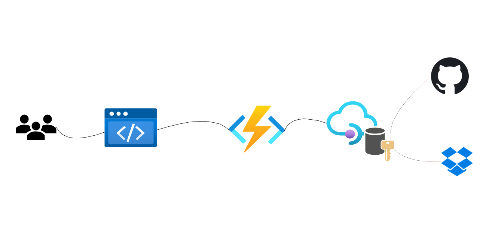

# swa-easytokens

Interactive user scenario built on top of Static Web Apps and APIM TokenStore. i.e. managing tokens for an application SignedIn user.

### Setup API Management Authorizations

    Create a APIM service say swa-easytokens See ./setup/deploy.sh

    Deploy Generic Proxy API in APIM service. See ./setup/deploy.sh

    Create Authorization Providers say github, dropbox etc see `https://docs.microsoft.com/en-us/azure/api-management/authorizations-how-to`
    
### Setup FunctionApp

    Create a FunctionApp say swa-easytokens

    Deploy ./byo-func code to the functionapp. Functions VSCode extension greatly simplifies this

    Turn on Managed Identity for the FunctionApp

    Assign the FunctionApp Managed Identity access to APIM Service created above. This si required to interact with ARM and create resources in APIM like Authorizations

    Add the appsettings to the  deployed functionapp pointing to above apim service

    "APIMGATEWAYURL": "https://swa-easytokens.azure-api.net",
    "APIMKEY": "<apimSubscriptionkey",
    "APIMSUBSCRIPTIONID": "",
    "APIMSERVICENAME": "swa-easytokens",
    "APIMRESOURCEGROUP": "swa-easytokens"

### Setup Static Web App

    Create a SWA with Standard Sku use this repo. The app content is in /.app

    Attach the above created FunctionApp to SWA

    Browse to the SWA endpoint to test the E2E working

